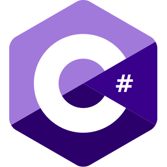

# About

Hi I'm @AshOnDiscord, I mainly go by Ash.  
I am a coder(mainly front-end) who codes as a side-hobby as well as some graphic designing.

# Languages

<section style="display:grid; grid-template-columns: repeat(5, 1fr); gap: 1rem;">
  
  
  
  
  
</section>

# Contact

<ul>
  <li>
    <a title="Ash#4999">Discord2</a>
  </li>
  <li>
    <a href="https://www.youtube.com/channel/UC9ZG0ecrPu7BnoI1zlAaleQ">Youtube<a>
  </li>
  <li>
    <a title="Temporarily Removed">Reddit<a>
  </li>
  <li>
    <a href="https://www.twitch.tva/AshOnDiscord">Twitch<a>
  </li>
</ul>

# Stats

  
  

